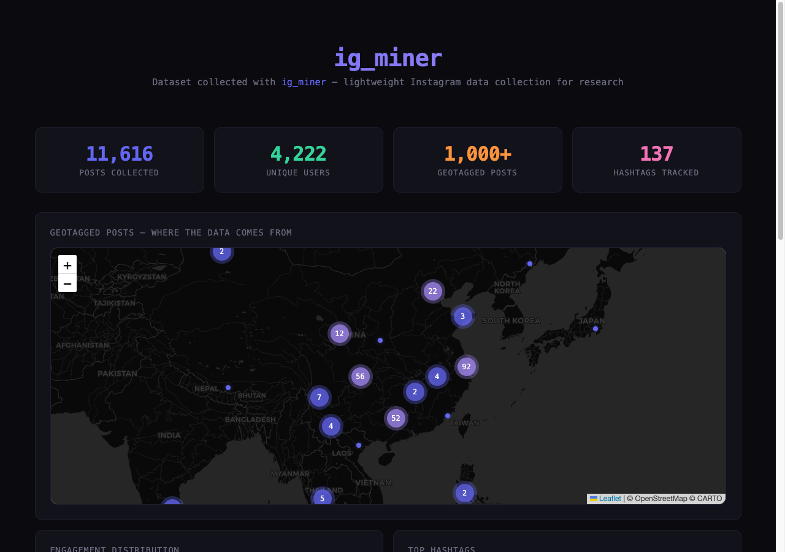

# ig_miner

**Lightweight Instagram data collection tool for academic research and analysis.**

> Built for researchers who need Instagram metadata (captions, hashtags, engagement, comments) at scale. Uses your own authenticated session — no third-party APIs, no proxies, no headless browsers.

```bash
pip install ig-miner
ig-miner auth            # one-time: extract cookies from your Chrome
ig-miner scrape travel   # collect public posts from #travel
```

<p align="center">
  
</p>

> **Note**: This tool is intended for academic research, data science, and educational purposes. It only accesses **publicly available data** through your own authenticated Instagram session. Please read the [Responsible Use](#responsible-use) section before getting started.

### Real dataset collected with ig_miner

<p align="center">
  
</p>

<p align="center">
  <em>11,616 posts across 137 hashtags — collected in under 24 hours with zero bans.
  <a href="demo/dashboard.html">View full interactive dashboard</a></em>
</p>

---

## What is ig_miner?

ig_miner is a Python tool that collects public Instagram data for research. It was originally built for a university information retrieval course project — we needed 20,000+ posts with captions, comments, and engagement metrics for building a search engine and training ML models.

Existing tools kept breaking or getting rate-limited. So we built ig_miner with a different approach: **use your own browser's session cookies** to make requests exactly like your browser does.

### What data can you collect?

| Data | Fields |
|------|--------|
| **Posts** | Shortcode, caption, hashtags, likes, comments count, views, location (name + lat/lng), timestamp, image URL |
| **Comments** | Text, author, likes, timestamp |
| **User profiles** | Username, bio, follower/following counts, post count, verification status |
| **Images** | Full-resolution downloads (1440px+) |

### How is it different?

| | ig_miner | instaloader | instagrapi |
|---|---|---|---|
| Auth method | Session cookies (from your browser) | Programmatic login | Programmatic login |
| Rate limiting | Gentle built-in delays | Manual | Manual |
| Comments API | Works (with proper headers) | Limited | Works |
| Image quality | Full resolution | Thumbnails by default | Full |
| 24/7 collection | Built-in daemon mode | No | No |
| Storage | SQLite / JSON / Supabase | Files | Custom |
| Setup | `pip install` + one command | `pip install` | `pip install` |

---

## Setup

### Step 1: Install

```bash
pip install ig-miner
```

### Step 2: Authenticate (one-time)

ig_miner needs your Instagram session cookies. You have three options:

#### Option A: Auto-extract from Chrome (Recommended)

If you're logged into Instagram in Chrome:

```bash
# macOS / Linux
pip install ig-miner[chrome]
ig-miner auth
```

This reads cookies from Chrome's local storage. Your password is never accessed — only the session token.

<details>
<summary>Prerequisite for macOS</summary>

Chrome must allow cookie access. If `ig-miner auth` fails with a keychain error, you may need to grant Terminal (or your IDE) access to Chrome's safe storage in System Settings → Privacy & Security → Full Disk Access.

</details>

#### Option B: Export manually from DevTools

1. Open **instagram.com** in Chrome (make sure you're logged in)
2. Press **F12** (or Cmd+Option+I on Mac) to open DevTools
3. Go to **Application** tab → **Cookies** → `https://www.instagram.com`
4. Find and copy these values into a file called `ig_cookies.json`:

```json
{
  "sessionid": "paste_your_sessionid_here",
  "csrftoken": "paste_your_csrftoken_here",
  "ds_user_id": "paste_your_ds_user_id_here",
  "mid": "paste_your_mid_here",
  "ig_did": "paste_your_ig_did_here",
  "rur": "paste_your_rur_here"
}
```

> Only `sessionid` and `csrftoken` are strictly required. The others improve reliability.

#### Option C: Use a browser extension

Install [EditThisCookie](https://chromewebstore.google.com/detail/editthiscookie) or [Cookie-Editor](https://chromewebstore.google.com/detail/cookie-editor), go to instagram.com, export all cookies as JSON, and save as `ig_cookies.json`.

### Cookie lifespan

Instagram session cookies typically last **60–90 days**. When they expire, just re-run `ig-miner auth` or re-export from DevTools. ig_miner will warn you if your session has expired.

### Security note

Your `ig_cookies.json` file contains your Instagram session. **Treat it like a password:**
- It's in `.gitignore` by default — never commit it
- Don't share it with anyone
- If compromised, log out of Instagram in your browser (this invalidates the session)

---

## Usage

### Collect posts by hashtag

```bash
# Collect top/popular posts (best for research — high engagement)
ig-miner scrape travel --pages 20

# Collect recent posts (chronological)
ig-miner scrape travel --tab recent --pages 10

# Multiple hashtags at once
ig-miner scrape tokyo osaka kyoto --pages 10

# Metadata only (skip image downloads for faster collection)
ig-miner scrape travel --no-images
```

Each page returns ~24 posts. So `--pages 20` collects up to ~480 posts per hashtag.

### Collect comments

```bash
# Collect comments for the top 200 posts (by likes) in your database
ig-miner comments --limit 200
```

### Check your database

```bash
ig-miner stats
#   Posts:          4,821
#   Unique codes:   4,821
#   Enriched users: 1,203
```

### Continuous collection (daemon mode)

For large-scale research datasets:

```bash
# Collect continuously with built-in rate limiting and pauses
ig-miner daemon --hashtags travel food photography --target 50000

# Run in background (persists after terminal close)
nohup ig-miner daemon --target 50000 > collection.log 2>&1 &
```

The daemon:
- Cycles through your hashtag list (top posts → comments → recent posts)
- Randomizes request timing (not robotic patterns)
- Automatically backs off on rate limits (waits 30–60s)
- Handles cookie expiration with auto-refresh
- Stops gracefully on SIGTERM/SIGINT (Ctrl+C)

---

## Data format

### Posts

```json
{
  "code": "CxR2a4Nv3",
  "username": "traveler_jane",
  "caption": "Golden hour at the Great Wall #travel #china #sunset",
  "hashtags": ["#travel", "#china", "#sunset"],
  "likes": 12847,
  "comments_count": 234,
  "views": null,
  "image_url": "https://scontent-...",
  "location_name": "Great Wall of China",
  "location_lat": 40.4319,
  "location_lng": 116.5704,
  "posted_at": "2025-11-15T08:23:14",
  "word_count": 8
}
```

### Comments

```json
{
  "id": "17890234567",
  "post_id": "CxR2a4Nv3",
  "username": "photo_enthusiast",
  "text": "Incredible shot! The lighting is perfect",
  "likes": 23,
  "posted_at": "2025-11-15T12:45:00"
}
```

### User profiles

```json
{
  "username": "traveler_jane",
  "full_name": "Jane Smith",
  "bio": "Travel photographer | 50 countries",
  "followers": 45200,
  "following": 892,
  "post_count": 1247,
  "is_verified": false
}
```

---

## Storage backends

### SQLite (default)

Zero config. Data is stored in `ig_miner.db` in the current directory.

```bash
ig-miner scrape travel
# → ig_miner.db (SQLite, queryable with any SQL tool)
```

### JSON files

```bash
ig-miner scrape travel --storage json --output-dir ./data
# → data/posts_20260210_143022.json
```

### Supabase (cloud database + image hosting)

For teams or when you need cloud access to your dataset:

```bash
ig-miner scrape travel \
  --storage supabase \
  --supabase-url https://your-project.supabase.co \
  --supabase-key your_anon_key \
  --supabase-schema public \
  --supabase-bucket ig-images
```

<details>
<summary>Supabase SQL schema</summary>

```sql
CREATE TABLE ig_users (
  username TEXT PRIMARY KEY,
  full_name TEXT,
  bio TEXT,
  followers INTEGER,
  following INTEGER,
  post_count INTEGER,
  is_verified BOOLEAN DEFAULT FALSE,
  is_private BOOLEAN DEFAULT FALSE,
  profile_pic_url TEXT,
  scraped_at TIMESTAMPTZ DEFAULT NOW()
);

CREATE TABLE ig_posts (
  id TEXT PRIMARY KEY,
  code TEXT UNIQUE NOT NULL,
  username TEXT REFERENCES ig_users(username),
  caption TEXT,
  hashtags TEXT[],
  image_url TEXT,
  storage_url TEXT,
  media_type INTEGER DEFAULT 1,
  likes INTEGER DEFAULT 0,
  comments_count INTEGER DEFAULT 0,
  views BIGINT,
  location_name TEXT,
  location_lat FLOAT,
  location_lng FLOAT,
  posted_at TIMESTAMPTZ,
  scraped_at TIMESTAMPTZ DEFAULT NOW(),
  word_count INTEGER DEFAULT 0
);

CREATE TABLE ig_comments (
  id TEXT PRIMARY KEY,
  post_id TEXT REFERENCES ig_posts(id),
  username TEXT REFERENCES ig_users(username),
  text TEXT,
  likes INTEGER DEFAULT 0,
  posted_at TIMESTAMPTZ
);

CREATE INDEX idx_posts_username ON ig_posts(username);
CREATE INDEX idx_posts_likes ON ig_posts(likes DESC);
CREATE INDEX idx_comments_post ON ig_comments(post_id);
```

</details>

---

## Python API

```python
from ig_miner.cookies import load_cookies
from ig_miner.api import fetch_hashtag_posts, fetch_comments, fetch_user_profile
from ig_miner.storage import get_storage

cookies = load_cookies("ig_cookies.json")
storage = get_storage("sqlite", db_path="research_data.db")

# Collect posts
posts = fetch_hashtag_posts("travel", cookies, max_pages=5, tab="top")
for post in posts:
    storage.upsert_post(post)
    print(f"{post['code']}: {post['likes']} likes")

# Collect comments
comments = fetch_comments("CxR2a4Nv3", cookies)

# Collect user profile
profile = fetch_user_profile("natgeo", cookies)

storage.close()
```

---

## Rate limiting

ig_miner is designed to be a good citizen of the Instagram platform:

- **Randomized delays** between all requests (1.5–3s for pages, 10–25s between hashtags)
- **Automatic backoff** on HTTP 429 responses (waits 30–60s before retrying)
- **Request patterns** are randomized to avoid predictable timing
- **Daemon mode** includes 5–10 minute pauses between full cycles

**Recommendations:**
- Run at most 1–2 instances simultaneously
- Use `--pages 20` or less per hashtag for reasonable collection sizes
- The daemon mode is already tuned for sustainable long-running collection

---

## Responsible use

This tool was built for legitimate research. We ask that you use it responsibly:

**Do:**
- Use for academic research, data science, and educational projects
- Collect only publicly available data
- Respect rate limits (ig_miner handles this automatically)
- Anonymize personal data in published research
- Cite your data collection methodology in papers
- Delete collected data when your research is complete

**Don't:**
- Scrape private or protected accounts
- Use collected data for commercial purposes without proper authorization
- Build surveillance tools or stalking applications
- Sell or redistribute personal data
- Spam, harass, or contact scraped users
- Circumvent Instagram's access controls beyond what your session allows

**Legal context:**
- This tool accesses the same public data you see when browsing Instagram in your browser
- It uses your own authenticated session — no credentials are shared or stored beyond your local machine
- Academic research involving publicly available social media data is generally protected, but check your institution's IRB (Institutional Review Board) requirements
- Comply with GDPR, CCPA, and other applicable data protection laws in your jurisdiction

If you're using this for published research, consider adding a data collection ethics statement to your paper.

---

## How it works (technical)

ig_miner makes HTTP requests to Instagram's internal web API using your session cookies. The key technical details:

1. **Session cookies** from your browser provide authentication (no programmatic login needed)
2. **Browser-identical headers** including `Sec-Fetch-Dest`, `Sec-Fetch-Mode`, `x-ig-app-id`, and `x-requested-with` ensure API compatibility
3. **Hashtag sections API** (`/api/v1/tags/{tag}/sections/`) returns paginated post data
4. **Comments API** (`/api/v1/media/{pk}/comments/`) returns threaded comments
5. **Profile API** (`/api/v1/users/web_profile_info/`) returns public user metadata

All endpoints are the same ones Instagram's web app uses when you browse normally.

---

## Contributing

Contributions welcome! Areas we'd appreciate help with:

- [ ] Windows cookie extraction testing
- [ ] Firefox / Safari cookie support
- [ ] Export to CSV / Parquet / HuggingFace datasets
- [ ] Reel / video metadata collection
- [ ] Location-based collection
- [ ] Async support (aiohttp)
- [ ] Better documentation and examples

---

## Citation

If you use ig_miner in academic work, please cite:

```bibtex
@software{ig_miner,
  author = {Pang, Haoyang},
  title = {ig\_miner: Lightweight Instagram Data Collection for Research},
  year = {2026},
  url = {https://github.com/PHY041/ig_miner}
}
```

---

## License

MIT — see [LICENSE](LICENSE) for details.
